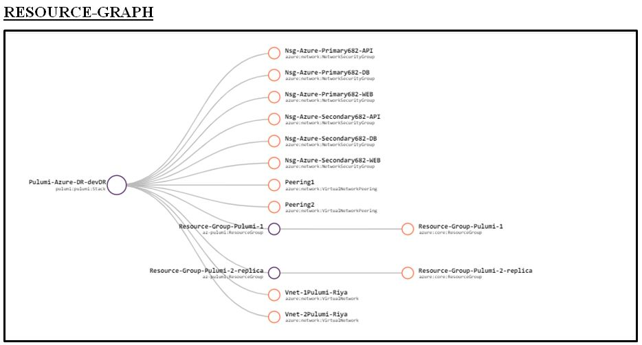

# Business Continuity and Disaster Recovery using Pulumi-js

Web-API-Database is a 3 tier architecture which decouples to presentation, business or application and database layers individually. The business layer exposes its API to applications as well as for the remote presentation layer. Remote presentation layer uses REST API. There is an internal database API for communications between application layer and database layer. REST API’s input is processed by the application layer to perform CRUD operations on the database.
<br />

<p align="center">

<br />
    <b> Figure 1.1: Three Tier Architecture </b>  
</p>

<br /><br />
This template creates a Virtual Network with 3 subnets (Webserver, API, Database). Further, Network Security Group are created for each and Inbound, Outbound rules are added to their respective NSG limiting traffic as Web-subnet acts as un-trusted network, DB-Subnet acts as semi-trusted network and API-subnet acts as fully-trusted network.
For default values , you may refer to [`index.json`](https://github.com/riyaagrahari/Pulumi-Azure/blob/master/Create-Vnet-NSG-Subnet/index.js) file.

Below is the Architectural Diagram for the primary VNets and subnets which are created and network security rules are applied to subnets using NSG.

    

<br />
<p align="center">
    <b> Figure 1.2: Detailed Architectural Diagram for Primary VNet.</b>
</p>
Replica of the primary vnet with its subnets and NSGs are created at some secondary location which comes up as recovery solution in case of a disaster. Communication between these Vnets is established using global peering.

In case of disaster, rules of NSG are appended opening custom ports on both Vnet, allowing database synchronization from secondary to primary region.<br />
Below is the architectural diagram for disaster recovery solution developed where a replica secondary vnet is created and peering is established between them.

<p align="center">

<br />
    <b> Figure 1.3: Azure Architectural Diagram for Disaster Recovery Solution- Primary and Secondary Vnet. </b>
</p>
<br /><br />

## Installation

- Install <b>Pulumi package</b> for your respective Operating System and setup Pulumi CLI. (Refer [`Download Pulumi`](https://www.pulumi.com/docs/reference/install/) )

- After Installation, verify pulumi is installed or not by using
 ```bash
$ pulumi version
```
- Install Node.js (Refer [`Download Node.js`](https://nodejs.org/en/download/) )<br />

- Install <b>Pulumi with Node.js</b> <br/>
 (Note: Make sure to install all npm dependency before using the following command)<br />
 Install using npm to use pulumi from JavaScript or TypeScript in Node.js
 ```bash
$ npm install @pulumi/azure
```
- Configure Azure (Refer [`Azure Configuration`](https://www.pulumi.com/docs/reference/clouds/azure/setup/) )
Note: If Azure CLI is working on your local system , skip this step 

- Create a New Project
 ```bash
$ mkdir <folder name> && cd <folder name>
$ pulumi new azure-javascript
```
Note: If ```pulumi new``` is being used for the first time, you will be asked to login to [`Pulumi Cloud Console`](https://app.pulumi.com/). Sign up and Login there using Azure Credentials.

It will ask for project name and stack name. Change it as desired or to use default just press Enter.

It will generate some project files in your current folder which are as follows: <br />
- ```Pulumi.yaml``` which defines your project.<br />

- ```Pulumi.dev.yaml``` which contains stack configuration values.<br />

- ```index.js``` which defines your stack resources.
## Usage
After creating a new project and stack in Pulumi using ```pulumi new azure-javascript```<br />

- Download the JavaScript files in the folder [`Create-Vnet-NSG-Subnet`](https://github.com/riyaagrahari/Pulumi-Azure/tree/master/Create-Vnet-NSG-Subnet), paste and replace it in your current folder where Pulumi project is initiated.
- [`index.js`](https://github.com/riyaagrahari/IaC-using-Pulumi/blob/master/Create-Vnet-NSG-Subnet-DisasterRecovery/index.js) is the master template which calls all other templates in it.
```index.js``` executes first and calls the follwing linked templates:

- [`create-rg.js`](https://github.com/riyaagrahari/IaC-using-Pulumi/blob/master/Create-Vnet-NSG-Subnet-DisasterRecovery/create-rg.js)is the Resource Group Creation Template in a particular location. 

- [`create-nsg.js`](https://github.com/riyaagrahari/IaC-using-Pulumi/blob/master/Create-Vnet-NSG-Subnet-DisasterRecovery/create-nsg.js) is the Network Security Group Creation template which creates 3 NSG- WEB, API, DB which have their own inbound and outbound rules for traffic control.

- [`create-peering.js`](https://github.com/riyaagrahari/IaC-using-Pulumi/blob/master/Create-Vnet-NSG-Subnet-DisasterRecovery/create-peering.js) is used for creating peering from Primary to Secondary Virtual Network and Secondary to Primary Virtual Network.

- Deploy the Stack using following command
 ```bash
$ pulumi up
```
## Result
Result of the deployed resources can be viewed on [`Pulumi`](https://app.pulumi.com)
<p align="center">

<br />
    <b> Figure 1.1: Resource Graph of Resources Deployed </b>  
</p>

## License

This project is licensed under the  License - see the [`LICENSE.md`](https://github.com/riyaagrahari/ARM-Templates/blob/master/LICENSE) file for details
## Author

[`Riya Agrahari`](https://github.com/riyaagrahari/)<br />

