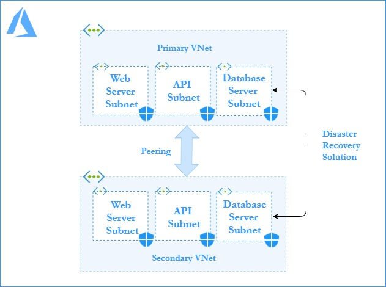

# Pulumi-js Code to implement Disaster Recovery Solution for Virtual Network

Web-API-Database is a 3 tier architecture which decouples to presentation, business or application and database layers induvidually. The business layer exposes its API to applications as well as for the remote presentation layer. Remote presentation layer uses REST API. There is a internal database API for communications between application layer and database layer. REST API’s input is processed by the application layer to perform CRUD operations on the database.
<br />

<p align="center">

<br />
    <b> Figure 1.1: Three Tier Architecture </b>  
</p>

<br /><br />
This template creates a Virtual Network with 3 subnets (Webserver, API, Database). Further, Network Security Group are created for each and Inbound, Outbound rules are added to their respective NSG.
For default values , you may refer to [`Parameter.json`](https://github.com/riyaagrahari/ARM-Templates/blob/master/VNet_Template_MultipleSubnet/Parameter.json) file.

Below is the Architectural Diagram for the primary VNets and subnets which are created and network security rules are applied to subnets using NSG.

    

<br />
<p align="center">
    <b> Figure 1.2: Detailed Architectural Diagram for Primary VNet.</b>
</p>
Replica of the primary vnet with its subnets and NSGs are created at some secondary location which comes up as recovery solution in case of a disaster. Communication between these Vnets is established using global peering.

In case of disaster, rules of NSG are appended opening custom ports on both Vnet, allowing database synchronization from secondary to primary region.<br />
Below is the architectural diagram for disaster recovery solution developed where a replica secondary vnet is created and peering is established between them

<p align="center">

<br />
    <b> Figure 1.3: Azure Architectural Diagram for Disaster Recovery Solution- Primary and Secondary Vnet. </b>
</p>
<br /><br />

## Installation

- Install <b>Pulumi package</b> for your respective Operating System and setup Pulumi CLI. (Refer [`Download Pulumi`](https://www.pulumi.com/docs/reference/install/) )

- After Installation, verify pulumi is installed or not by using
 ```bash
$ pulumi version
```
- Install Node.js (Refer [`Download Node.js`](https://nodejs.org/en/download/) )<br />

- Install <b>Pulumi with Node.js</b> <br/>
 Install using npm to use pulumi from JavaScript or TypeScript in Node.js
 ```bash
$ npm install @pulumi/azure
```
- Configure Azure (Refer [`Azure Configuration`](https://www.pulumi.com/docs/reference/clouds/azure/setup/) )
Note: If Azure CLI is working on your local system , skip this step 

- Create a New Project
 ```bash
$ mkdir <folder name> && cd <folder name>
$ pulumi new azure-javascript
```
Note: If ```pulumi new``` is being used for the first time, you will be asked to login to [`Pulumi Cloud Console`](https://app.pulumi.com/). Sign up and Login there using Azure Credentials.
It will ask for project name and stack name. Change it as desired or to use default just press Enter.
It will generate some project files in your folder<br \>
```Pulumi.yaml``` which defines your project.<br \>
```Pulumi.dev.yaml``` which contains stack configuration values.<br \>
```index.js``` which defines your stack resources.
- Download the files in the folder [`Create-Vnet-NSG-Subnet`](https://github.com/riyaagrahari/Pulumi-Azure/tree/master/Create-Vnet-NSG-Subnet)
- Deploy the Stack using following command
 ```bash
$ pulumi up
```

## License
This project is licensed under the  License - see the [`LICENSE.md`](https://github.com/riyaagrahari/ARM-Templates/blob/master/LICENSE) file for details
## Author
[`Riya Agrahari`](https://github.com/riyaagrahari/)<br />

